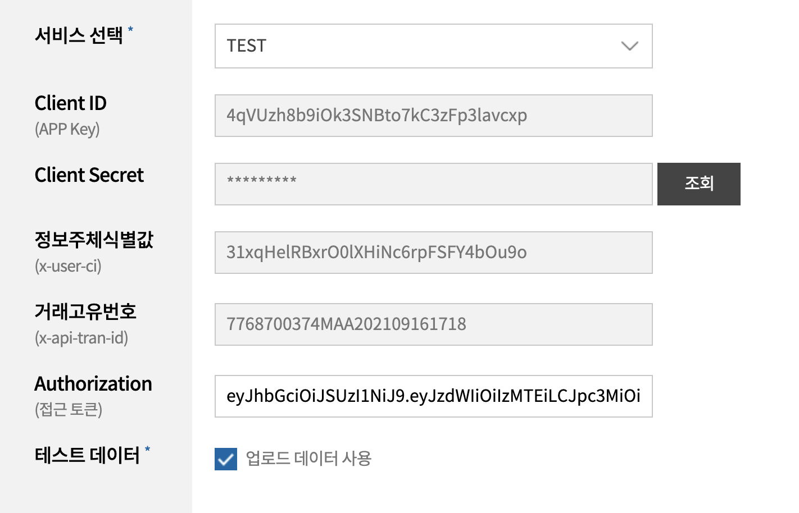
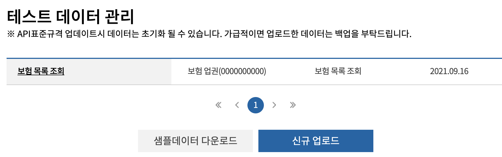
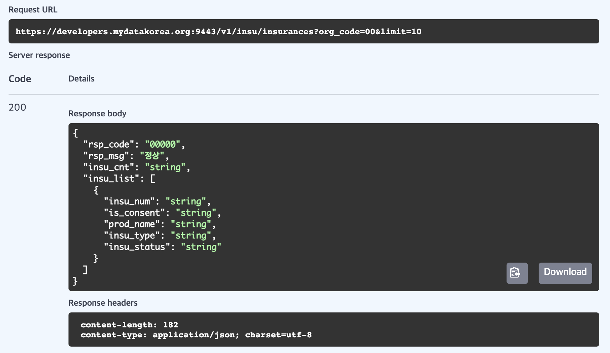

# 마이데이터 테스트베드
## 테스트 준비

- [https://developers.mydatakorea.org/](https://developers.mydatakorea.org/)
- Check List
    - [ ]  기업이용자 등록
    - [ ]  서비스 테스트 등록
    - [ ]  Client Id, Client Secret 발급
    - [ ]  정보주체 값 발급
    - [ ]  테스트 데이터 업로드 (기관코드)
    - [ ]  단위 테스트 인가 코드 발급
    - [ ]  단위 테스트 엑세스 토큰 발급
    - [ ]  테스트 데이터 사용 체크

    ex ) 준비 완료 예시

    

1. 마이데이터 테스트 베드 가입 완료(가입시 기업이용자로 가입)
2. 마이페이지 에서 “기업 및 이용자 등록”
3. 기업이용자 등록 클릭
4. 마이데이터 사업자 사업자번호 조회(000000000)
5. 관리자 요청
6. 관리자 알림 승인
7. 테스트베드 기업이용자 등록 완료
8. 로그아웃 후, 재로그인시 반영
9. 마이페이지 → 서비스테스트 → 서비스테스트 추가
10. 마이페이지 → 회원정보 변경 → 정보주체 값 key 발급

---

## 단위테스트

- [https://developers.mydatakorea.org/mdtb/tbd/ats/bas/FSTB010101?preURI=%2Fmdtb%2Ftbd%2Fats%2Fbas%2FFSTB010101&menuCode=FSI000%2CFSI028%2CFSI029%2CFSI031](https://developers.mydatakorea.org/mdtb/tbd/ats/bas/FSTB010101?preURI=%2Fmdtb%2Ftbd%2Fats%2Fbas%2FFSTB010101&menuCode=FSI000%2CFSI028%2CFSI029%2CFSI031)
- API URL : [https://developers.mydatakorea.org:9443](https://developers.mydatakorea.org:9443/)

### 단위테스트 진행 순서

1. 개별인증 API
    1. 인가코드 발급 요청
    2. 접근토큰 발급 요청 → Access Token 복사
    3. Access Token을 Authorization에 붙여넣기
2. 각종 금융업권 API
    1. 해당 API의 테스트데이터 업로드 ([https://developers.mydatakorea.org/mdtb/myp/tem/ddm/FMTM0201L](https://developers.mydatakorea.org/mdtb/myp/tem/ddm/FMTM0201L))

        ex) 업로드한 테스트데이터 목록
        
        

    2. 테스트데이터가 존재하는 API 요청/응답 확인

        ex) 업로드한 테스트데이터 응답 확인
        
