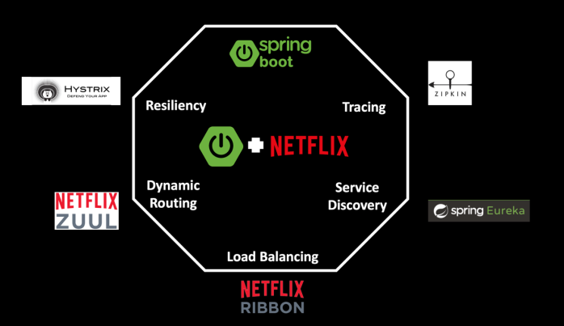
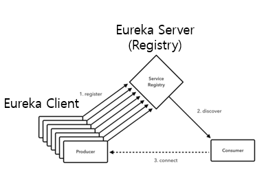
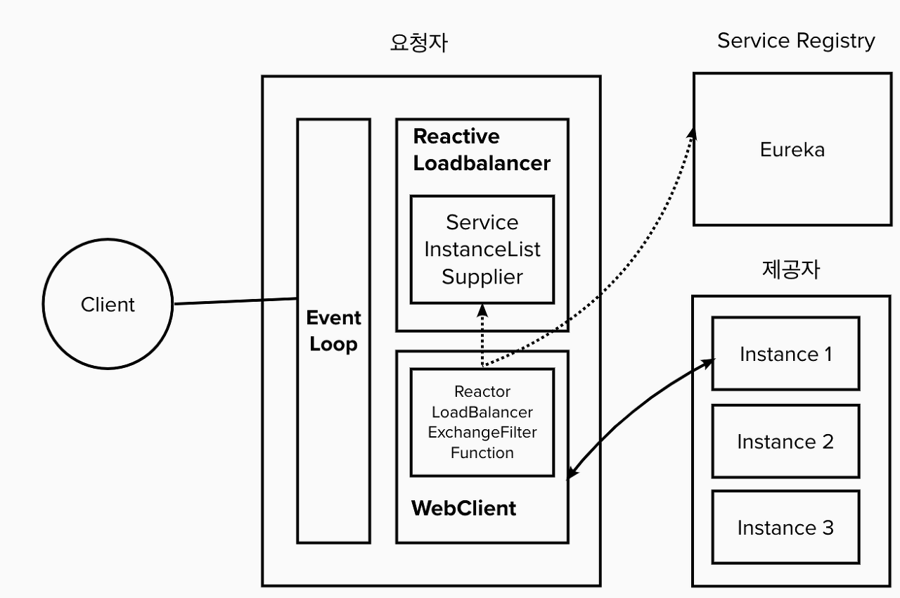

# Netflix OSS

- Netflix OSS는 Spring Cloud 기반의 MSA를 구현하는 오픈소스 프레임워크

    

- Netfilx OSS의 구성
  - Service Discovery : Eureka
  - Circuit Breaker : Hysrix
  - Intelligent Routing : Zuul
  - Client Side Load Balancing : Ribbon
  
- Netflix OSS의 MSA 5대 분류 특징
  1. Service Discovery : Eureka
  2. Load Balancing : ~~Ribbon~~ (Spring Cloud LoadBalancer)
  3. Dynamic Routing : ~~Zuul~~ (Spring Cloud Gateway)
  4. Tracing : Zipkin 
  5. Resiliency : ~~Hystrix~~ (Resilience4j)

- **Eureka**
  - Service Discovery & Registry 담당
  - MSA 내에서 각 Service들을 Registry에 등록하고, Registry를 기반으로 다른 서비스를 Discovery 함
  
     
  - MSA의 Service들은 Eureka Client가 되어 자신의 hostname, ip, port 등 자신의 Meta Data를 Eureka Server에 전송하여 Registry 됨
  - Eureka Client는 Eureka Server를 통해 다른 Client의 Meta Data를 사용 할 수 있음
  - Eureka Server는 각 Client로 부터 정해진 (기본 30초) 시간 마다 Heartbeat을 수신
  - Heartbeat이 오지 않는 Service는 죽은 것으로 판단하고, Registry에서 제거
  
- **~~Ribbon~~ (지원 종료)**
  - Client Side Load Balancer 담당
  - Ribbon은 각 Service Instance들의 Load Balancing을 수행함
  - API Gateway에서도 Ribbon을 통해 Load Balancing을 수행 할 수 있으며, Ribbon을 사용하면 API Gateway가 없이 직접 Load Balancing을 수행 할 수 있음
  - Ribbon의 L/B Rules
    1. Round Robin
        - 각 Service를 돌아가며 연결하는 방식
    2. Availability Filtering Rule
         - Service 중 가용성이 높은 것 부터 연결하는 방식
         - 3번 이상 연결이 실패하면 30초 동안 연결을 하지 않음 (Ribbon 내부의 Circuit Breaker 모듈 사용, 설정 가능)
    3. Weighted Response Time Rule
         - 응답시간이 빠른 Service 부터 연결하는 방식
  - **2018년 12월 이후 EOS 되었기 때문에, Spring Cloud LoadBalancer를 사용함**

- **Spring Cloud LoadBalancer**
  - LoadBalancer
    - Server Side LoadBalancer (Hardware)
       -  L4, L7 계층의 Switch
       -  단점
          - Switch의 처리 능력 한계
          - Switch의 Scale out 어려움
          - 비용이 비쌈
          - Switch의 문제를 대비해 이중화
          - 사람이 수동적으로 조절해야 하기 때문에 유연하지 못함
    - Client Side LoadBalancer (Software)
      - Ribbon, Spring Cloud LoadBalancer
      - Switch를 거치지 않고 바로 서버에 요청을 하는 것
      - 비싼 Switch에서 하던 분산 역할을 Software에서 처리
      - Switch를 추가하는 것보다 Client에 코드를 추가하기 때문에 쉽고 빠른 문제해결 가능
      - Client Side LoadBalancer를 구현하기 위한 필요조건
        - 클라이언트는 랜덤 혹은 특정한 알고리즘으로 (RR같은) 클러스터로 묶여있는 서버중에 랜덤으로 접속을 하여 부하를 분산할 수 있어야 함
        - 서버 접속에 있어 오류사항이 발생했을때 적절하게 대응이 가능해야 한다. 즉 클라이언트는 서버가 특정 시간동안 응답 하지 않는다면 다른 서버를 선택하여 접속가능 해야함
        - 클러스터에 있는 서버들은 최종 사용자에게 (해당 접속 라이브러리를 사용하는 개발자) 한개의 서버로 보여야 함

  - Ribbon과 비교

    |구분|Ribbon|SCL|
    |:----|:----|:----|
    |지원 HttpClient|Rest Template(Blocking)|Rest Template(Blocking), Web Client(Non-Blocking)|
    |지원 LB 정책| Round Robin, Availability Filtering Rule, Weighted Response Time Rule | Round Robin, Random |
    
       

    

  - 동작 방식
    1. Client 요청을 EventLoop Job에 등록
    2. ServiceInstanceListSupplier로 생성된 Bean이 있는지 체크
    3. WebClient의 filter로 주입한 ReactorLoadBalancerExchangeFilterFunction으로 Service Instance 목록을 조회하고 없을 시 Registry Server(Eureka)에서 목록 조회
    4. Service Instance 목록에서 LoadBalancer 정책에 따라 Service Instance를 연결
    5. 연결된 Instance의 주소를 WebClient로 전달
    6. WebClient는 SCL에 제골된 Service Instance의 주소를 호출
    7. 응답을 받은 EventLoop는 Client에 리턴
   
- **~~Juul~~**
  - Juul 1
  - Juul 2

- **Spring Cloud Gateway**
  - API Gateway
  - Juul 1,2 와 비교