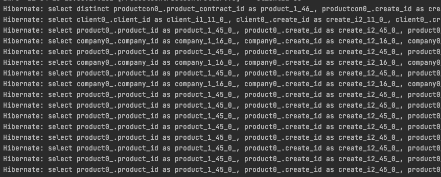
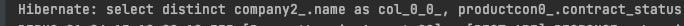

> 1.  상황에 따라 객체지향 / 전통적 쿼리 방식을 골라 사용할 것
> 2. JPA / Querydsl로 발생하는 쿼리 한번 더 확인할 것
> 3. JPA와 DB 학습 양 쪽을 다 할 것**

> **진짜 Entity가 필요한게 아니라면, QueryDSL와 Dto를 통해 필요한 컬럼들만 조회하고 업데이트하는 것이 좋습니다.**


# 1. QueryDsl 동적 쿼리 사용

## 1. BooleanBuilder 클래스 사용

```java
@RequiredArgsConstructor
@Repository
public class BookRepositoryImpl implements BookRepositoryCustom {

    private final JPAQueryFactory queryFactory;
    
    @Override
    public List<Book> findBooks(String name, String author) {
    	
        BooleanBuilder builder = new BooleanBuilder();
        
        if (!StringUtils.isEmpty(name)) {
        	builder.and(book.name.eq(name));
        }
    
    	if (!StringUtils.isEmpty(idx)) {
        	builder.and(book.author.eq(author));
        }
        
        return queryFactory
        	.selectFrom(book)
                .where(builder)
                .fetch();
    }
```

- `BooleanBuilder`를 이용하여 `where`절을 만들 수 있음
- But 조건이 많아질 수록 쿼리 파악이 어려움

## 2. BooleanExpression 클래스 사용

```java
@RequiredArgsConstructor
@Repository
public class BookRepositoryImpl implements BookRepositoryCustom {

    private final JPAQueryFactory queryFactory;
    
    @Override
    public Page<Book> findBooks(Stirng name, String author, Pageable pageable) {
        QueryResults<Book> book = queryFactory
                .selectFrom(review)
                .where(
								    eqName(name),
                    eqAuthor(author)
                )
                .orderBy(Book.updatedAt.desc(), Book.idx.desc())
                .offset(pageable.getOffset())
                .limit(pageable.getPageSize())
                .fetchResults();

        return new PageImpl<>(result.getResults(), pageable, result.getTotal());
    }
    
    private BooleanExpression eqName(String name) {
    	if (StringUtils.isEmpty(name)) {
        	return null;
        }
        
        return book.name.eq(name);
    }
```

- `BooleanExpression`을 반환하는 별도의 메소드를 사용
- `where` 절에 `null`이 들어가면 해당 조건은 자동으로 사용되지 않음
- But, 모든 조건이 `null`이라면 모든 `row`를 조회함
- 모든 `row` 를 조회하기 않기 위해 `where` 절에 기본 조건, 혹은 모든 조건이 `null` 인 경우의 조건을 주어야 함

## 3. Pageable 동적 정렬 적용 방안

> 100개 미만의 데이터의 정렬이 필요한 경우 WAS의 자원을 사용하는 것을 추천한다.

> JPA를 사용하면 `Pageable` 클래스에서 제공하는 `Sort` 클래스를 사용하여 손쉬운 정렬이 가능하지만, QueryDsl의 `orderBy` 메소드는 `Sort` 클래스를 지원하지 않는다.

- 별도의 메소드를 작성하여 `orderBy` 메소드의 `OrderSpecifier` 클래스로 형변환 진행

```java
//Query
QueryResults<Client> queryList = queryFactory
      .selectFrom(client)
      .leftJoin(clientPlannerBind)
      .on(client.id.eq(clientPlannerBind.client.id).and(clientPlannerBind.planner.id.eq(plannerId)))
      .orderBy(**parsingSortedColumn(pageable.getSort())**)
      .offset(pageable.getOffset())
      .limit(pageable.getPageSize())
      .fetchResults();

//Parsing Method
private OrderSpecifier<?>[] parsingSortedColumn(Sort sorts){
    return sorts.stream().map(x ->{
      Order order = x.getDirection().name() == "ASC"? Order.ASC : Order.DESC;
      SimplePath<Object> filedPath = Expressions.path(Object.class,x.getProperty());
      return new OrderSpecifier(order, filedPath);
    }).toArray(OrderSpecifier[]::new);
  }
```

- `Entity` 혹은 `Dto`에서 지원하는 모든 컬럼에 대한 정렬 및 다중 정렬 활용 가능

## 4. CASE WHEN 조건문 사용하기

> SQL의 CASE WHEN은 안티패턴이라고 생각합니다. (스파게티 쿼리)
좋은 구조라면 서버에서 비즈니스 로직을 처리하는 것이 좋습니다.

- QueryDsl는 `CaseBuilder` 클래스를 통해 `case`-`when` 을 수행함

```java
return queryFactory
                .select(Projections.fields(PointCalculateAmount.class,
                        new CaseBuilder()
                            .when(pointEvent.pointStatus
                                .in(PointStatus.USE, PointStatus.USE_CANCEL))
                            .then(pointEvent.pointAmount
                                .multiply(-1))
                            .otherwise(pointEvent.pointAmount)
                                .as("pointAmount"),
                        pointEvent.pointStatus
                ))
                .from(pointEvent)
                .fetch();
```

- `CaseBuilder`를 통해 CaseWhen 문법 시작
- `when`: 조건문
- `then`: `when`절이 `true`일 경우 실행
- `otherwise`: `when`절이 `false`일 경우 실행
- `otherwise`가 끝나면 결과 물에 대한 alias(`as`) 적용
    - 일반적으로는 Entity의 필드명이 자동으로 as 적용됨
    - 하지만 `CaseBuilder`를 통해 계산한 결과물은 필드명이 없음
    - alias 하지 않으면 결과물 필드가 어떤 필드로 가야할지 명시되지 않아 **오류가 발생**
- `when`-`then` 은 추가로 작성가능

---

# 2. QueryDsl Select 성능 개선 방안

## 1. exists 메소드 대체하기

> **exitsts 메소드란?**
두 테이블 간의 결과를 어떤 값이 존재하는 지를 알고 싶은 경우 사용한다. 
핵심은 값이 존재하는 가를 판단하는 것이다.

- QueryDsl의 `exists`는 SQL의 `exists`를 사용하지 않고, 전체를 조회하는 `count()`를 사용하여 수행함
- QueryDsl의 문제는 SQL의 `exists`를 사용할 수 없는 것
- 객체지향 쿼리인 JPQL은 `from` 없이 쿼리를 생성할 수 없기 때문
- **때문에, 만족하는 row를 1개라도 찾으면 바로 종료하는 쿼리를 직접 구현해야 함**
- **방법은 `limit 1`로 조회를 제한 하는 것**

```java
@RequiredArgsConstructor
@Repository
public class BookQueryRepository {

    private final JPAQueryFactory queryFactory;
    
    @Transactional(readOnly = true)
    public Boolean exist(Long idx) {
        Integer fetchOne = queryFactory
                .selectFrom(book)
                .where(book.idx.eq(idx))
                .fetchFirst();
                
        return fetchOne != null;
    }
}
```

- `JPAQueryFactory`의 `fetchFirst`는 제일 먼저 조회되는 하나의 대상만 반환
- `limit(1).fetchOne()`과 동일
- **조회결과가 없는 경우 `null`을 반환하기 때문에 `null` 체크를 통해 엔티티 존재 여부를 반환할 수 있음**

## 2. Cross Join 회피하기

> **Cross Join이란?
Cross Join**은 상호 조인이라고도 불리며,
한 쪽 테이블의 모든 행들과 다른 테이블의 모든 행을 조인시키는 기능을 한다.
Cross Join의 결과 개수는 두 테이블의 행의 개수를 곱한 개수가 된다.
ex) 1테이블의 row 갯수 * 2테이블의 row 갯수 = Cross Join(1테이블, 2테이블).count

- **JPA와 QueryDsl을 사용하면서, 명시적 Join인 아닌 `where`절의 동치로 묵시적 Join을 하는 경우 Cross Join이 발생**
- 명시적으로 Join을 함으로써, Cross Join을 방지

```java
@RequiredArgsConstructor
@Repository
public class BookQueryRepository {

    private final JPAQueryFactory queryFactory;
    
    @Override
    public Optional<BookDto> findBookDtoByIdx(Long idx) {
        return Optional.ofNullable(queryFactory
                .select(Projections.fields(BookDto.class,
			        book.name,
                    Expressions.asNumber(idx)
                        .as("idx"),
                    lender.idx
                        .as("lenderIdx")// BookDto 매핑 필드와 이름 매칭
                ))
                .from(book)
                .innerJoin(book.lender, lender)
                .where(eqIdx(idx))
                .fetchOne());
    }
}
```

## 3. Entity가 아닌 Dto 사용하기 (중요)

> **QueryDsl을 사용할 때 보통 `Entity`를 사용하여 조회 결과를 매핑하는 것이 일반적입니다.
그러나, 이 방법은 생각보다 성능상 단점이 많습니다.
1. 엔티티의 모든 컬럼을 가져오기 때문에 로직에서 사용하지 않는 불필요한 컬럼도 가져옵니다.
2. 영속성 컨텍스트의 캐싱 기능을 반드시 사용하게 됩니다.
3. `@OneToOne` 관계에 있는 엔티티의 정보도 울며 겨자먹기로 가져와야 합니다.**

- 비즈니스 로직에서 실시간으로 `Entity` 변경이 필요한 경우 `Entity`로 조회를 사용
- 대량의 데이터 조회가 필요하거나 성능 최적화를 고강도로 하고 싶은 경우 `Dto` 조회를 사용
- `Projections` Class를 사용하여 Custom된 `Dto`로 필요한 필드만 매핑
- `@OneToOne`처럼 Lazy Loading이 일반적으로 불가능한 연관관계를 갖는 엔티티 정보가 필요한 경우도 연관 엔티티의 일부 컬럼만을 가져옴으로 해결 ( `.as()` 사용 )
- 추가적으로 이 방법으로 불필요한 컬럼을 제외함으로써, `distinct`의 성능 또한 최적화가 가능함

```java
@RequiredArgsConstructor
@Repository
public class BookQueryRepository {

    private final JPAQueryFactory queryFactory;
    
    @Override
    public Optional<BookDto> findBookDtoByIdx(Long idx) {
        return Optional.ofNullable(queryFactory
                .select(Projections.fields(BookDto.class,
				              book.name,
			                Expressions.asNumber(idx).as("idx"),
											// BookDto 매핑 필드와 이름 매칭
											lender.idx.as("lenderIdx")		
                ))
                .from(book)
                .where(
	                    eqIdx(idx)
                )
                .fetchOne());
    }
}
```

- `Entity` 조회 나쁜 예

```java
productContracts = queryFactory.selectFrom(productContract).distinct()
          .innerJoin(contractCoverage)
          .on(contractCoverage.productContract.id.eq(productContract.id))
          .fetchJoin()
          .where(productContract.client.id.eq(clientId))
          .orderBy(productContract.product.productName.asc())
          .fetch();
```

- `ProductContract` `Entity`를 `selectFrom`으로 전체 조회
- `ProductContract` 내부의 `Entity`를 통해 `ContractCoverage` `Entity`와 InnerJoin
- 1건 조회를 위한 엄청난 양의 쿼리 발생



- `Dto` 조회로 변환

```java
queryFactory.select(
      Projections.fields(ProductContractView.class,
        company.name.as("companyName"),
        productContract.contractStatus,
        company.logoUrl,
        productContract.monthlyPaymentPremium,
        productContract.payAll,
        productContract.paymentCycle,
        productContract.paymentPeriod,
        productContract.id.as("productContractId"),
        product.id.as("productId"),
        product.productName,
        company.subdivision
      )
    ) .distinct()
      .from(productContract)
      .innerJoin(product)
      .on(product.id.eq(productContract.product.id))
      .innerJoin(company)
      .on(company.id.eq(product.company.id))
      .where(productContract.client.id.eq(clientId))
      .orderBy(product.productName.asc())
      .fetch();
```

- `Projections` `Class`를 사용하여 필요한 컬럼만 조회
- `Product`, `Company` `Entity`를 이용한 직접 JOIN



- 1건 쿼리 발생

## 4. 커버링 인덱스 적용하기

> **커버링 인덱스란?**
커버링 인덱스란 쿼리를 충족시키는 모든 컬럼을 포함하고 있는 인덱스입니다.
`select`, `where`, `order by`, `group by` 등에서 사용되는 모든 컬럼이 인덱스 안에 존재합니다.
커버링 인덱스는 페이징 성능을 향상시키는 일반적인 수단입니다.
예를 들어 아래와 같은 페이징 쿼리를

```sql
SELECT *
FROM items
WHERE 조건문
ORDER BY id DESC
OFFSET 페이지번호
LIMIT 페이지사이즈
```

> 아래처럼 처리한 코드를 이야기합니다.

```sql
SELECT  *
FROM  items as i
JOIN (SELECT id
        FROM items
        WHERE 조건문
        ORDER BY id DESC
        OFFSET 페이지번호
        LIMIT 페이지사이즈) as temp on temp.id = i.id
```

> 이렇게 커버링 인덱스로 빠르게 걸러낸 `row`의 `id`를 통해 실제 `select` 절의 항목들을 빠르게 조회해오는 방법입니다.

- 먼저 QueryDsl에서는 `from` 절의 서브쿼리를 지원하지 않음
- 따라서 QueryDsl에서는 쿼리를 2개의 쿼리로 분리해서 사용함
    1. 커버링 인덱스를 활용해 조회 대상의 PK를 조회
    2. 해당 PK로 필요한 컬럼 항목들 조회

```java
public List<BookPaginationDto> paginationCoveringIndex(String name, int pageNo, int pageSize) {
        // 1) 커버링 인덱스로 대상 조회
        List<Long> ids = queryFactory
                .select(book.id)
                .from(book)
                .where(book.name.like(name + "%"))
                .orderBy(book.id.desc())
                .limit(pageSize)
                .offset(pageNo * pageSize)
                .fetch();

        // 1-1) 대상이 없을 경우 추가 쿼리 수행 할 필요 없이 바로 반환
        if (CollectionUtils.isEmpty(ids)) {
            return new ArrayList<>();
        }

        // 2)
        return queryFactory
                .select(Projections.fields(BookPaginationDto.class,
                        book.id.as("bookId"),
                        book.name,
                        book.bookNo,
                        book.bookType))
                .from(book)
                .where(book.id.in(ids))
                .orderBy(book.id.desc())
                .fetch(); // where in id만 있어 결과 정렬이 보장되지 않는다.
}
```

- `selecet` 에는 `id` 만 포함하여 커버링 인덱스를 활용해 빠르게 조회
    - 조회 결과 `id` 가 없으면 빈 값 반환
    - QuereyDsl 특성상 `in` 에 비어있는 List가 들어가게 되면 오류가 발생하는 것, 불필요하게 추가 쿼리가 발생하는 것을 방지
- 위의 결과로 발생항 `id` 로 실제 `select` 절 조회
    - `where` `id` `in` `()` 밖에 없기 때문에, 정렬 된 상태로 조회 되지 않음
    - `.orderBy(book.id.desc())` 를 추가하여 정렬함