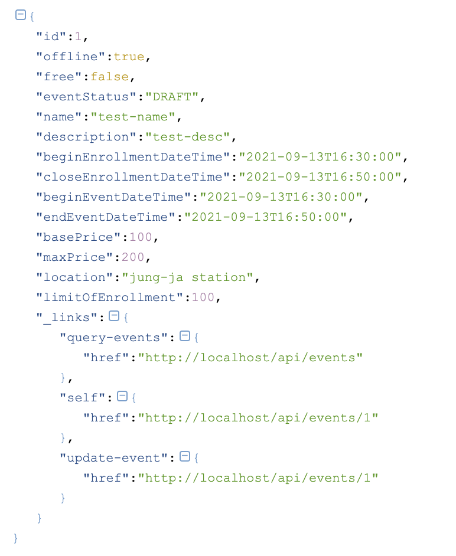

# Spring-HATEOAS  
## HATEOAS
- hypermedia를 사용하여 Application Server간의 정보를 동적으로 주고 받는 방법
- Application의 상태정보에 따라 hypermedia가 바뀌어야 함

## Spring-HATEOS
 - 링크(hypermedia)를 만드는 기능
   - 문자열을 가지고 만들기
   - 컨트롤러와 메소드로 만들기
 - 리소스를 만드는 기능
   - 리소스 = 데이터 + 링크
 - 링크를 찾아주는 기능
   - Traveson
   - LinkDiscoverers
 - 링크
   - HREF
   - REL
     - self
     - profile
     - ...
 - 테스트할 것
   - 응답(Response)에 HATEOAS와 profile관련 링크가 있는지 확인
     - self (view)
     - update (만든 사람은 수정이 가능함)
     - events (목록조회로 가는 링크)
 - EntityModel
   - 링크를 추가하여 HATEOAS 형태의 응답 모델을 반환해 줌
   - Controller 코드 
    ``` java
        Event newEvent = eventRepository.save(event);
        LinkBuilder linkBuilder = linkTo(EventController.class).slash(newEvent.getId());
        URI createdUri = linkBuilder.toUri();
        EntityModel<Event> eventEntityModel = new EntityModel<>(newEvent);
        eventEntityModel.add(linkTo(EventController.class).withRel("query-events"));
        eventEntityModel.add(linkBuilder.withSelfRel());
        eventEntityModel.add(linkBuilder.withRel("update-event"));
        return ResponseEntity.created(createdUri).body(eventEntityModel);
    ``` 
    - 응답 json
      - "_links" 아래 값으로 링크가 생성 됨

      