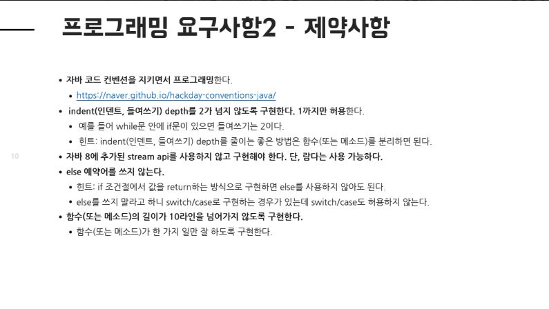

## 프리코스 참여후기

----
우아한테크캠프 pro(이하 우테켐)는 무료 강의도 아닌데, 무려 2주동안 코딩테스트같은 과제전형을 거친다.  
대망의 1주차 미션 `숫자야구게임` 3년차 이상 개발자를 대상으로 하는 강의에서 `숫자야구게임` ??  
그러나, 아래와 같은 제약조건이있다.     

 

- 인덴트 depth는 1까지만..
  - else 예악어를 쓰지 않기..
  - 메소드 길이는 10라인 이하..

 
간단한 미션이라고 생각했지만, 많은 고민과 시행착오가 있었다.  
미션을 해결하기 위하여 TDD를 가장 중점적으로 사용하였고,
가장 작은 단위의 기능부터 구현을 하려 노력했다.

이번 미션 중 가장 어려움을 겪었던 것은 MVC 패턴에 맞추어 기능을 구현하는 것과
의미있는 단위의 커밋을 올리는 것이 가장 어려웠다.

의미있는 단위의 커밋을 하기 위해서, 러프하게 생각했던 각 기능들을 좀더 세분화하게 되었고,
코드가 더 간결하게 작성된 것 같다.  
또한, MVC에 맞추어 각자의 역할을 분명히하여 구현을 하다보니 좀더 모듈간의 결합도를 낮출 수 있었던 것 같다.  

간단하고 짧은 과제였지만 개인적으로 깊게 생각하고, 더 공부할 수 있었던 기회였다.